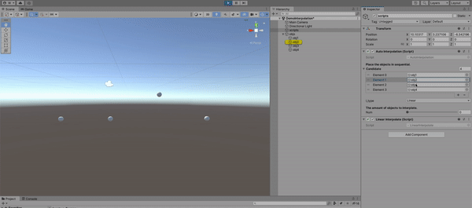

# unity-interpolation
A tool for automated interpolation objects in Unity.

## Demo

## How to use?
1. Download the [unity package](https://github.com/GanniPiece/unity-interpolation/releases/download/untagged-74d559d7132a6b266e94/unity-interpolation-v0.0.1.unitypackage)
2. Import the package to Unity project
3. Drag the `DemoInterpolation` scene under the `Assets/Scenes` into Hierarchy
4. Load the scene and you can modify the `candidate objects` and other options under `AutoInterpolation` script
    * 

